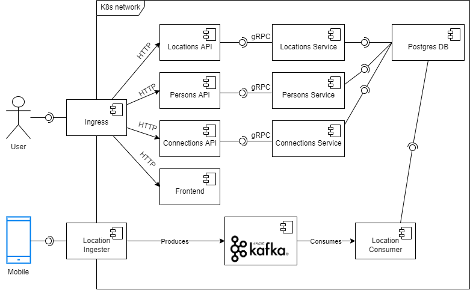

# UdaConnect

## Overview

### Background

Conferences and conventions are hotspots for making connections. Professionals in attendance often share the same interests and can make valuable business and personal connections with one another. At the same time, these events draw a large crowd and it's often hard to make these connections in the midst of all of these events' excitement and energy. To help attendees make connections, we are building the infrastructure for a service that can inform attendees if they have attended the same booths and presentations at an event.

### Technologies

- [Flask](https://flask.palletsprojects.com/en/1.1.x/) - API webserver
- [SQLAlchemy](https://www.sqlalchemy.org/) - Database ORM
- [PostgreSQL](https://www.postgresql.org/) - Relational database
- [PostGIS](https://postgis.net/) - Spatial plug-in for PostgreSQL enabling geographic queries]
- [Vagrant](https://www.vagrantup.com/) - Tool for managing virtual deployed environments
- [VirtualBox](https://www.virtualbox.org/) - Hypervisor allowing you to run multiple operating systems
- [K3s](https://k3s.io/) - Lightweight distribution of K8s to easily develop against a local cluster

## Running the app

### Prerequisites

We will be installing the tools that we'll need to use for getting our environment set up properly.

1. [Install Docker](https://docs.docker.com/get-docker/)
2. [Set up a DockerHub account](https://hub.docker.com/)
3. [Set up `kubectl`](https://rancher.com/docs/rancher/v2.x/en/cluster-admin/cluster-access/kubectl/)
4. [Install VirtualBox](https://www.virtualbox.org/wiki/Downloads) with at least version 6.0
5. [Install Vagrant](https://www.vagrantup.com/docs/installation) with at least version 2.0

### Environment Setup

To run the application, you will need a K8s cluster running locally and to interface with it via `kubectl`. We will be using Vagrant with VirtualBox to run K3s.

#### Initialize K3s

In this project's root, run `vagrant up`.

```bash
$ vagrant up
```

The command will take a while and will leverage VirtualBox to load an [openSUSE](https://www.opensuse.org/) OS and automatically install [K3s](https://k3s.io/). When we are taking a break from development, we can run `vagrant suspend` to conserve some ouf our system's resources and `vagrant resume` when we want to bring our resources back up. Some useful vagrant commands can be found in [this cheatsheet](https://gist.github.com/wpscholar/a49594e2e2b918f4d0c4).

### Steps

1. `kubectl apply -f deployment/db-configmap.yaml` - Set up environment variables for the pods
2. `kubectl apply -f deployment/db-secret.yaml` - Set up secrets for the pods
3. `kubectl apply -f deployment/grpc-configmap.yaml` - Set up environment variables related to the gRPC server
4. `kubectl apply -f deployment/postgres.yaml` - Set up a Postgres database running PostGIS
5. `kubectl apply -f deployment/udaconnect-api.yaml` - Set up the service and deployment for the API ingress
6. `kubectl apply -f deployment/udaconnect-app.yaml` - Set up the service and deployment for the web app
7. `kubectl apply -f deployment/udaconnect-connections-api.yaml` - Set up the service and deployment for the connections microservice
8. `kubectl apply -f deployment/udaconnect-locations-api.yaml` - Set up the service and deployment for the locations microservice
9. `kubectl apply -f deployment/udaconnect-persons-api.yaml` - Set up the service and deployment for the persons microservice
10. `kubectl apply -f deployment/udaconnect-swagger.yaml` - Set up the service and deployment for the API documentation
11. `sh scripts/run_db_command.sh <POD_NAME>` - Seed your database against the `postgres` pod. (`kubectl get pods` will give you the `POD_NAME`)

Manually applying each of the individual `yaml` files is cumbersome but going through each step provides some context on the content of the starter project. In practice, we would have reduced the number of steps by running the command against a directory to apply of the contents: `kubectl apply -f deployment/`.

Note: The first time you run this project, you will need to seed the database with dummy data. Use the command `sh scripts/run_db_command.sh <POD_NAME>` against the `postgres` pod. (`kubectl get pods` will give you the `POD_NAME`). Subsequent runs of `kubectl apply` for making changes to deployments or services shouldn't require you to seed the database again!

### Verifying it Works

These pages should load on your web browser:

- `http://localhost/api` - OpenAPI Documentation and base path for API
- `http://localhost/` - Frontend ReactJS Application

## PostgreSQL Database

The database uses a plug-in named PostGIS that supports geographic queries. It introduces `GEOMETRY` types and functions that we leverage to calculate distance between `ST_POINT`'s which represent latitude and longitude.

_You may find it helpful to be able to connect to the database_. In general, most of the database complexity is abstracted from you. The Docker container in the starter should be configured with PostGIS. Seed scripts are provided to set up the database table and some rows.

### Database Connection

While the Kubernetes service for `postgres` is running (you can use `kubectl get services` to check), you can expose the service to connect locally:

```bash
kubectl port-forward svc/postgres 5432:5432
```

This will enable you to connect to the database at `localhost`. You should then be able to connect to `postgresql://localhost:5432/geoconnections`. This is assuming you use the built-in values in the deployment config map.

### Software

To manually connect to the database, you will need software compatible with PostgreSQL.

- CLI users will find [psql](http://postgresguide.com/utilities/psql.html) to be the industry standard.
- GUI users will find [pgAdmin](https://www.pgadmin.org/) to be a popular open-source solution.

## Architecture Diagrams

The following diagram shows the architecture of the application using UML component diagram notation:


### Frontend

The frontend was left as one module rather than split into micro-frontends because it would be such an overkill for a simple one-page website as this to be divided further and would incur more cost than benefit.
Additionally, it was added under the same ingress as the API to avoid exposing additional ports and to have it under the same domain and avoid CORS issues.

### APIs

The APIs were split into microservices to allow for easier scaling and to allow for each service to be developed and deployed independently. This also allows for each service to be developed by different teams and to be deployed independently. Three independent modules were identified: persons, locations, and connections.

### Services

The front-facing RESTful API uses gRPC to communicate with the underlying service that handles communcation with the database. This allows for each module to be developed in a language that is more familiar to the developer and to be able to use the language's best practices and libraries. Additionally, gRPC is more efficient than HTTP.

Note: _services_ here denotes modules that handle connections to the database and are not to be confused with Kubernetes services or microservices. Also, the `*_pb2.py` and `*_pb2_grpc.py` files are gitignored because they are generated in a Docker image build step, and it is generally considered a good practice to not push auto-generated files to git.

### Database

The database was not split into more than one because it only contained 2 tables that are linked together. Splitting it would introduce more difficulty in maintaining the database and ensuring consistency with the foreign keys and contraints and would not provide any benefit since Postgres is already highly efficient and scalable.

### Kafka

Acting as a locations ingestion service, the Kafka module manages a topic to which the locations producer (the service exposed via gRPC) produces locations as they arrive from the user, to then be consumed by another module that stores them in the database.
